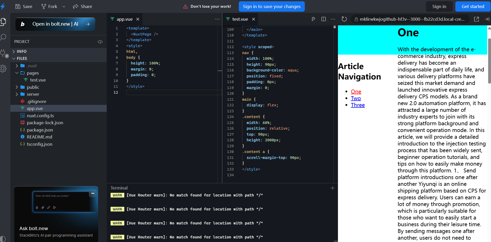

How did you do it? Did I make any mistakes




app.vue

```
<template>
  <NuxtPage />
</template>
<style>
html,
body {
  height: 100%;
  margin: 0;
  padding: 0;
}
</style>

```

test.vue

```vue
<template>
  <nav></nav>
  <main>
    <!-- 侧边栏部分 -->
    <aside
      style="
        width: 40%;
        position: sticky;
        top: 90px;
        height: calc(100vh - 150px);
      "
    >
      <h1>Article Navigation</h1>
      <ul id="toc-list">
        <li data-v-09ef3bc5="">
          <a href="#1">One</a>
        </li>
        <li>
          <a href="#2">Two</a>
        </li>
        <li>
          <a href="#3">Three</a>
        </li>
      </ul>
    </aside>
    <div class="content">
      <h1><a id="1">One</a></h1>
      <p>
        With the development of the e-commerce industry, express delivery has
        become an indispensable part of daily life, and various delivery
        platforms have seized this market demand and launched innovative express
        delivery CPS models. As a brand new 2.0 automation platform, it has
        attracted a large number of industry experts to join with its strong
        platform background and convenient operation mode. In this article, we
        will provide a detailed introduction to the injection testing process
        that has been widely sent, beginner operation tutorials, and tips on how
        to easily make money through this platform. 1、 Send platform
        introductions one after another Yiyunqi is an online shipping platform
        based on CPS for express delivery. Users can earn a lot of money through
        promotion, which is particularly suitable for those who want to easily
        start a business during their leisure time. By sending messages one
        after another, users do not need to manually place orders themselves,
        they only need to become agents of the platform and promote their
        exclusive invitation Ma. The design of the platform is extremely
        user-friendly, without requiring users to spend too much time and
        energy. With simple operations, the dual goals of saving money and
        making money can be achieved. We have a strong cooperative background
        and are supported by the well-known platform Meiguang, ensuring its
        stability and market recognition. After completing the shipping
        operation on the platform, users cooperate with major courier companies
        to provide services to users at the lowest cost price, while also
        allowing Daili to receive corresponding rewards. 彩
      </p>
      <h1><a id="2">Two</a></h1>
      <p>
        With the development of the e-commerce industry, express delivery has
        become an indispensable part of daily life, and various delivery
        platforms have seized this market demand and launched innovative express
        delivery CPS models. As a brand new 2.0 automation platform, it has
        attracted a large number of industry experts to join with its strong
        platform background and convenient operation mode. In this article, we
        will provide a detailed introduction to the injection testing process
        that has been widely sent, beginner operation tutorials, and tips on how
        to easily make money through this platform. 1、 Send platform
        introductions one after another Yiyunqi is an online shipping platform
        based on CPS for express delivery. Users can earn a lot of money through
        promotion, which is particularly suitable for those who want to easily
        start a business during their leisure time. By sending messages one
        after another, users do not need to manually place orders themselves,
        they only need to become agents of the platform and promote their
        exclusive invitation Ma. The design of the platform is extremely
        user-friendly, without requiring users to spend too much time and
        energy. With simple operations, the dual goals of saving money and
        making money can be achieved. We have a strong cooperative background
        and are supported by the well-known platform Meiguang, ensuring its
        stability and market recognition. After completing the shipping
        operation on the platform, users cooperate with major courier companies
        to provide services to users at the lowest cost price, while also
        allowing Daili to receive corresponding rewards. 彩
      </p>
      <h1><a id="3">Three</a></h1>
      <p>
        With the development of the e-commerce industry, express delivery has
        become an indispensable part of daily life, and various delivery
        platforms have seized this market demand and launched innovative express
        delivery CPS models. As a brand new 2.0 automation platform, it has
        attracted a large number of industry experts to join with its strong
        platform background and convenient operation mode. In this article, we
        will provide a detailed introduction to the injection testing process
        that has been widely sent, beginner operation tutorials, and tips on how
        to easily make money through this platform. 1、 Send platform
        introductions one after another Yiyunqi is an online shipping platform
        based on CPS for express delivery. Users can earn a lot of money through
        promotion, which is particularly suitable for those who want to easily
        start a business during their leisure time. By sending messages one
        after another, users do not need to manually place orders themselves,
        they only need to become agents of the platform and promote their
        exclusive invitation Ma. The design of the platform is extremely
        user-friendly, without requiring users to spend too much time and
        energy. With simple operations, the dual goals of saving money and
        making money can be achieved. We have a strong cooperative background
        and are supported by the well-known platform Meiguang, ensuring its
        stability and market recognition. After completing the shipping
        operation on the platform, users cooperate with major courier companies
        to provide services to users at the lowest cost price, while also
        allowing Daili to receive corresponding rewards. 彩
      </p>
    </div>
  </main>
</template>

<script setup>
definePageMeta({
  layout: false, // 禁用布局
});
</script>
<style scoped>
nav {
  width: 100%;
  height: 90px;
  background-color: aqua;
  position: fixed;
  padding: 0px;
  margin: 0;
}
main {
  display: flex;
}
.content {
  width: 60%;
  position: relative;
  top: 90px;
  height: 2000px;
}
.content a {
  scroll-margin-top: 90px;
}
</style>
```

